# Views
This section documents the system architecture using two modeling approaches: the C4, and the 4+1 architectural view model.
The adopted architectural frameworks are:
- [C4 Model](https://c4model.com/)
- [4 + 1 Model](https://en.wikipedia.org/wiki/4%2B1_architectural_view_model)

The levels are structured with the following logic:
1. Description of the system as a whole
2. Descpription of each macro container of the system
3. Description of all the components of each container
4. Granular description of the code 

We have decided to include only 4 levels to our documentation. Not all levels are fully documented, for reasons that should become apparent later, but these are the views we've decided were worthy of generating:
1. Level 1
    - Logic View
    - Process View
    - Scenario View
2. Level 2
    - Logic View
    - Implementation
3. Level 3
    - Logic View
    - Physical View
    - Process View
4. Level 4
    - Logic View
    - Process View
    - Implementation View

## Views

### Level 1
#### Logic View
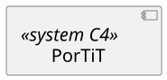
#### Process View
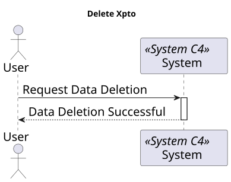
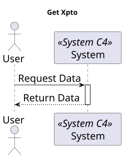

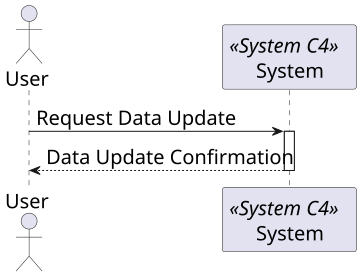
#### Scenario View
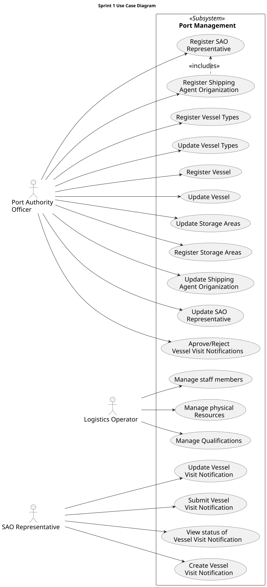

### Level 2
#### Logic View
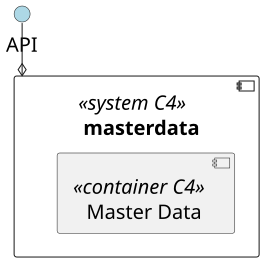
#### Implementation View
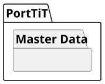
### Level 3
#### Logic View
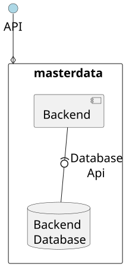
#### Physical View
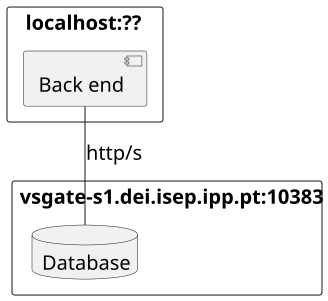
#### Process View
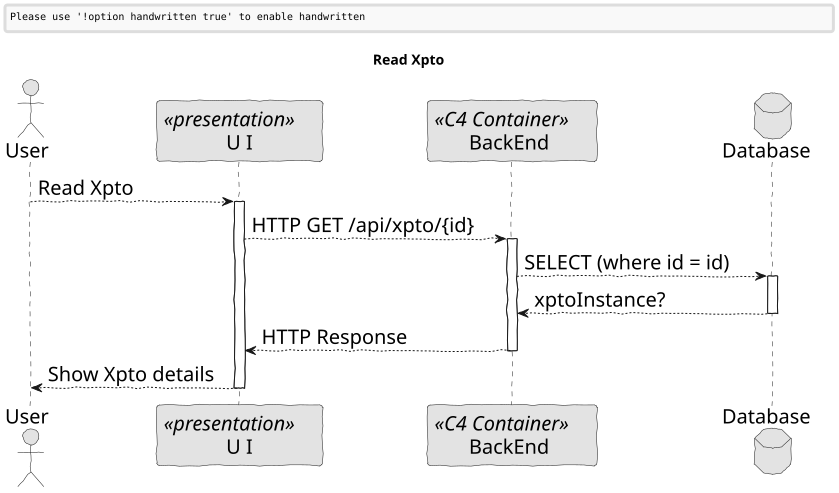
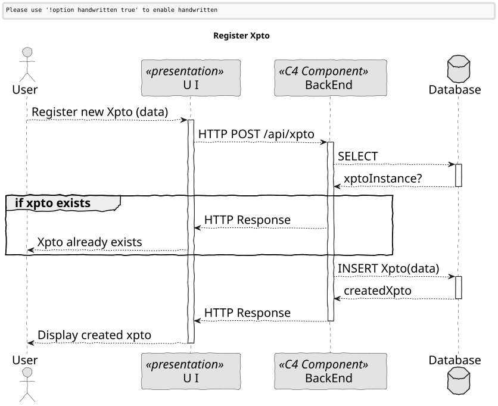
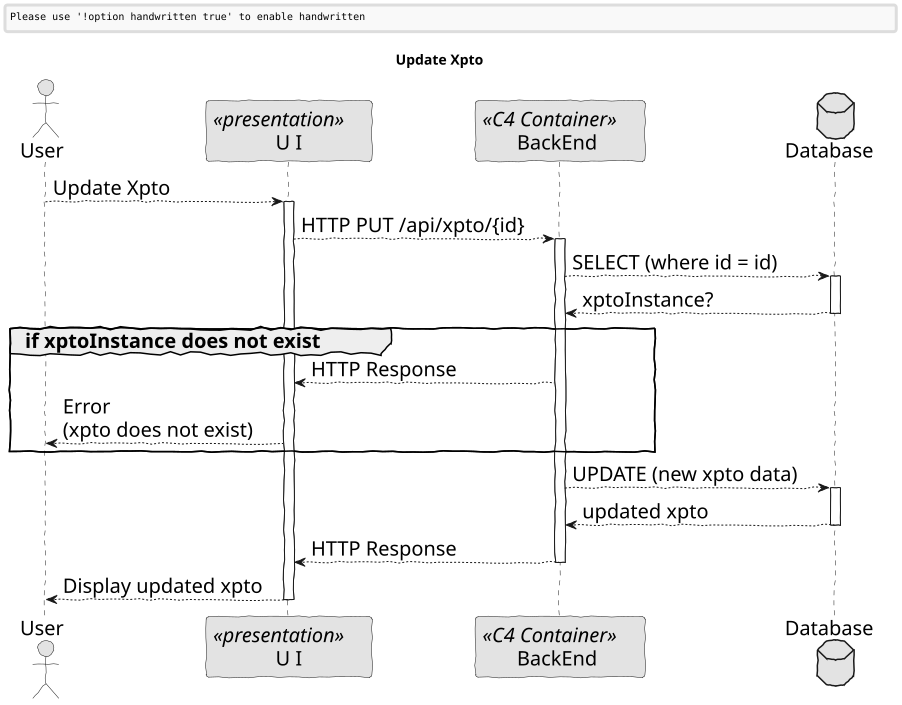
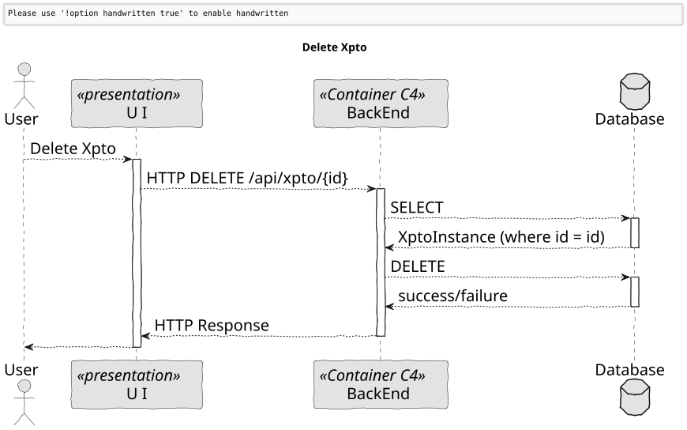
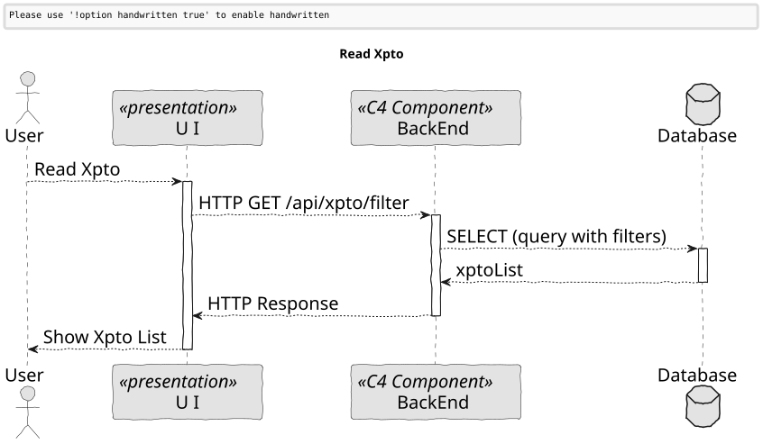

### Level 4
#### Logic View
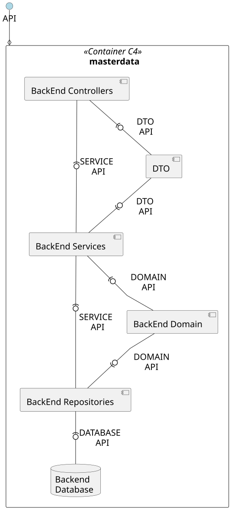
#### Process View
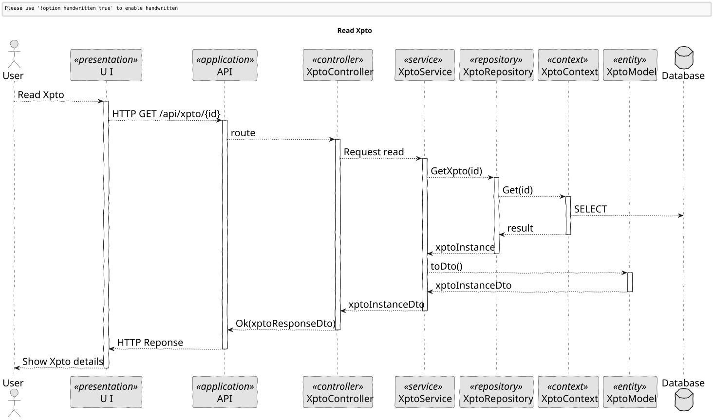
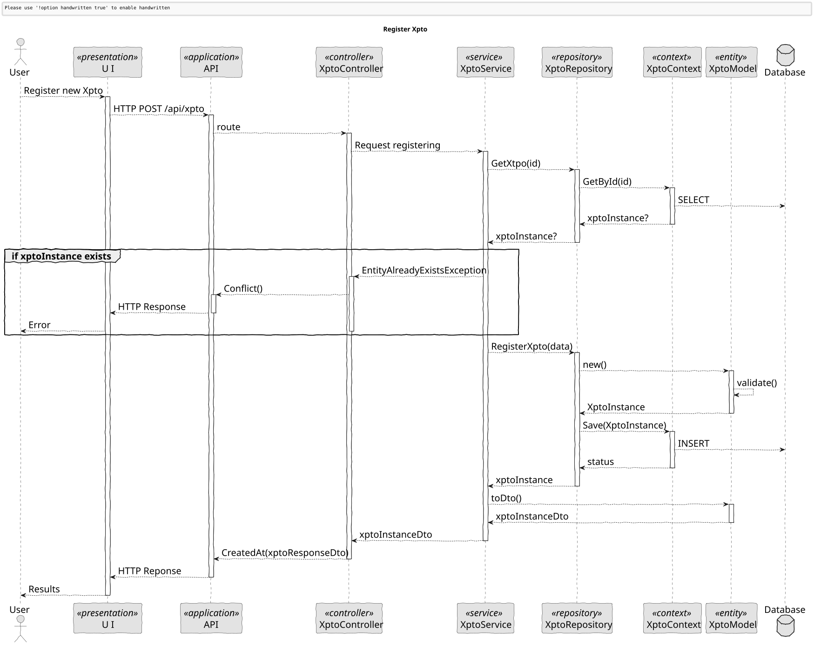
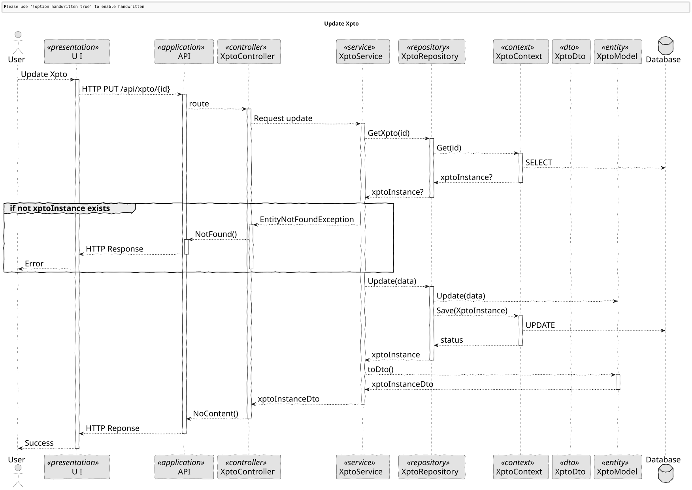
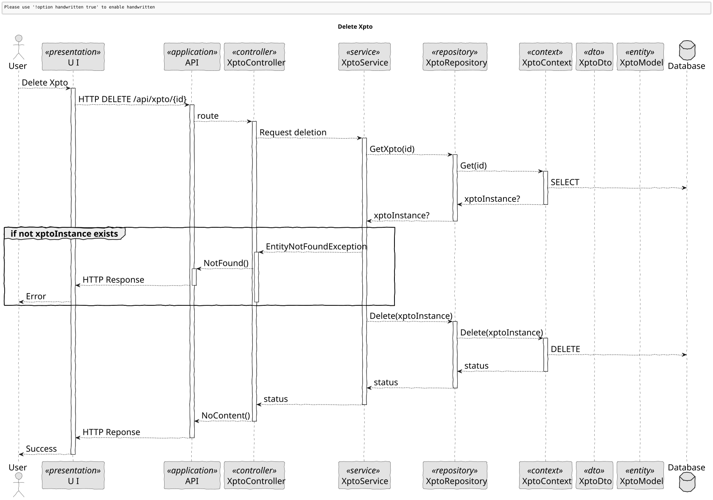
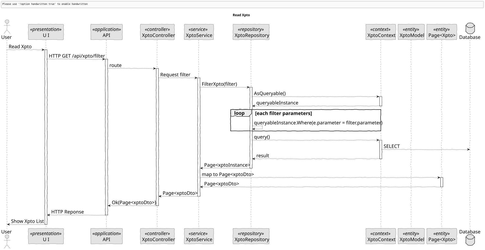
#### Implementation View
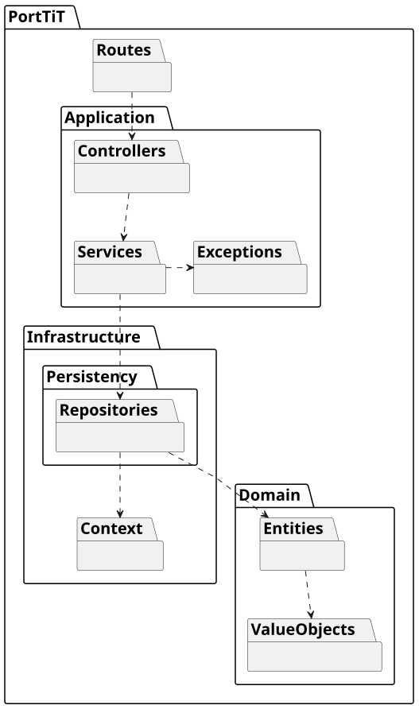

## Mapping between views
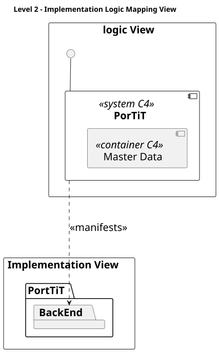
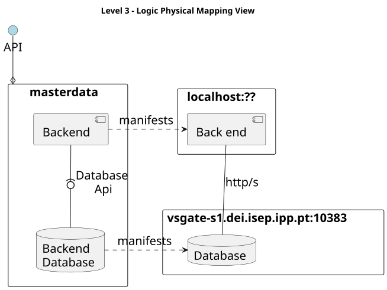
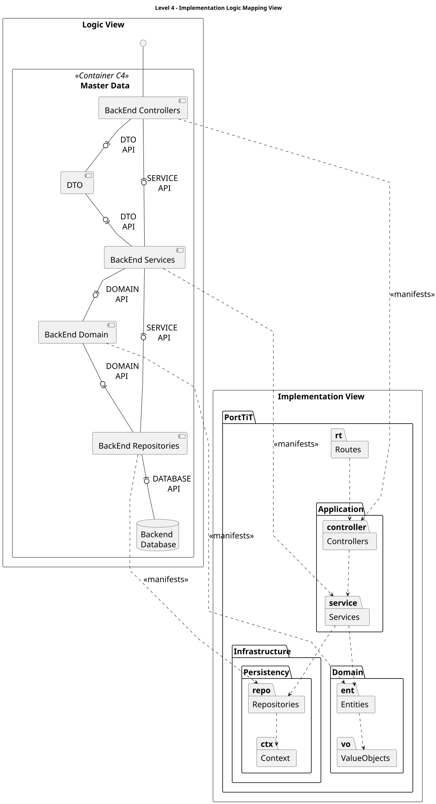