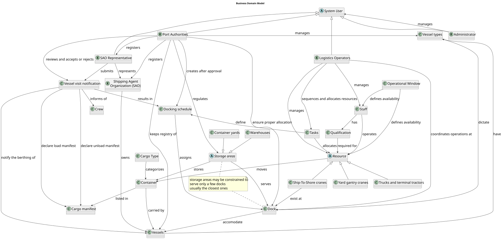
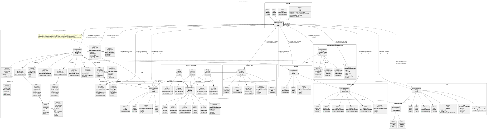
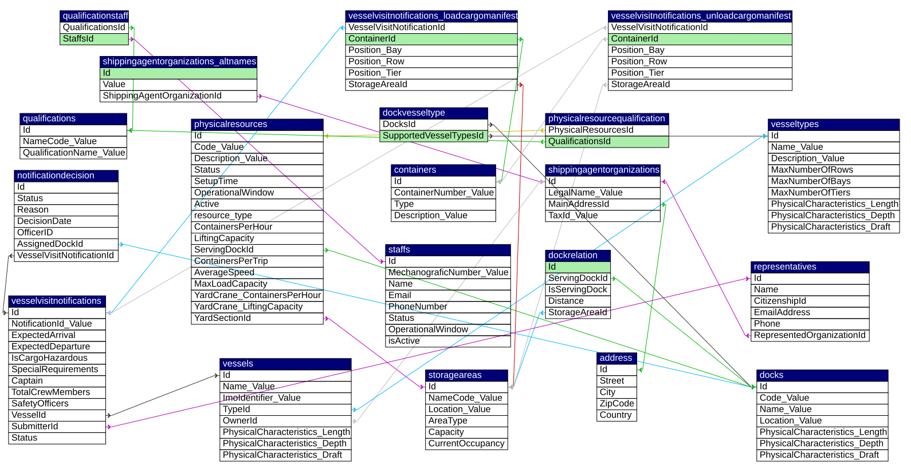

# Global Artifacts
This section serves as the central index for all design and architectural documentation related to the Port Logistics Management System.

### Glossary 
The glossary of business terms and abbreviations can be found [here](glossary.md)

## Analysis

### Business Model ( using DDD ):
This is an analysis model. It focuses on capturing the core business concepts, the relationships between them.

## Design documents
These are solution-oriented documents. They describe how the system will be built to implement the business needs.

## Views
For the architectural views, refer to [this document](./arquitecture/readme.md)

### Domain Model ( using DDD ):

### Database logical model (using MySQL )

