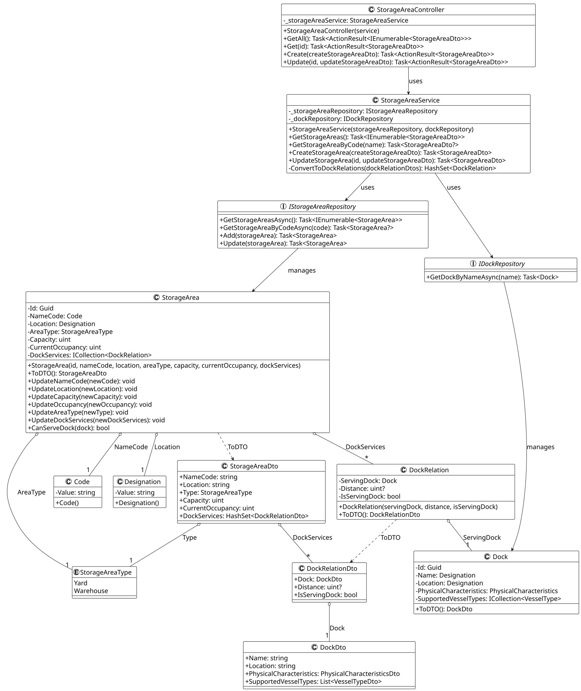

# US2204 - Manage storage areas

### Process View(s):

>**Note:** Since these features (CRUD operations) are common to (almost) all user stories, some/all diagrams displayed will be the general level 4 process view diagrams. 

#### - Create a storage area:
 

#### - Update a storage area:

#### - Get storage areas:

### Class Diagram(s):

 