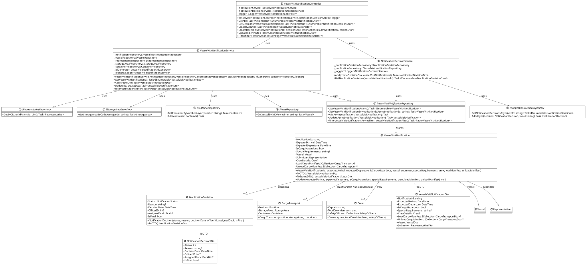

# US2209 - Change / complete a Vessel Visit Notification 

### Process View(s):

>**Note:** Since these features (CRUD operations) are common to (almost) all user stories, some/all diagrams displayed will be the general level 4 process view diagrams. 

#### - Update a vessel visit notification:

### Class Diagram(s):

 