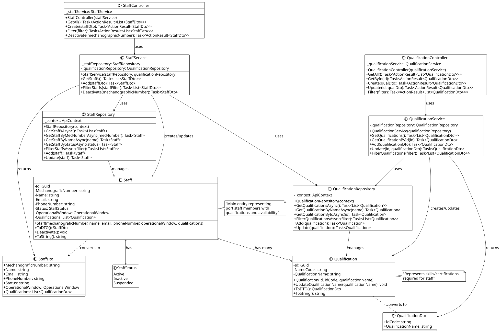

# US2211 - Register and manage operating staff members

### Process View(s):

>**Note:** Since these features (CRUD operations) are common to (almost) all user stories, some/all diagrams displayed will be the general level 4 process view diagrams. 

#### - Create a staff:
 

#### - Update:

#### - Deactivate:

#### - Filter:

### Class Diagram(s):

 