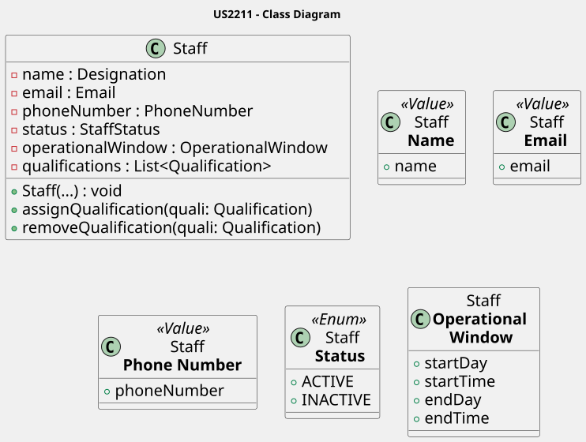

# US2211 - Register and manage operating staff members (create, update, deactivate) 

### System Sequence Diagrams per feature:

#### - Create:
 

#### - Update:
 

#### - Deactivate:
 

#### - Filter:

### Class Diagram:

 