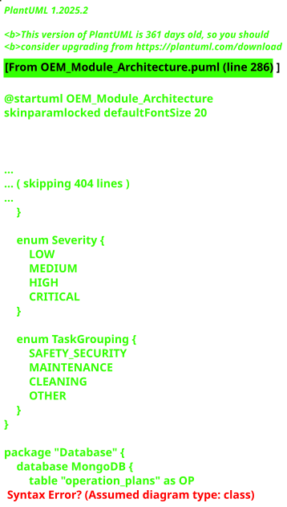

# US4101 - OEM Module Design

The OEM (Operations & Execution Management) module is an independent backend service designed with Clean Architecture principles. This design document outlines the system layers, components, and their interactions.

## Architecture Overview

The OEM module follows a layered architecture with strict separation of concerns:

1. **REST API Layer** - HTTP endpoint definitions and routing
2. **Application Layer** - Controllers handling request/response logic
3. **Business Logic Layer** - Service interfaces and implementations
4. **Data Access Layer** - Repository interfaces for data persistence
5. **Data Mapping Layer** - DTO-to-Entity mappings
6. **Domain Model Layer** - Pure business entity definitions
7. **Database Layer** - MongoDB persistence

## System Sequence Diagrams

The interaction flows between OEM module components and external systems:

## Class Diagrams

Complete class diagram showing all layers and their relationships:

## Key Design Patterns

- **Dependency Injection**: TypeDI container for loose coupling
- **Repository Pattern**: Abstracts data access operations
- **Mapper Pattern**: Separates DTOs from domain entities
- **Service Locator**: Central dependency resolution
- **Error Handling**: Centralized middleware for exception management

## Technology Stack

- **Framework**: Express.js with TypeScript
- **API Documentation**: TSOA (TypeScript OpenAPI/Swagger)
- **Database**: MongoDB with Mongoose schemas
- **Dependency Injection**: TypeDI
- **Validation**: Decorator-based schema validation

## Integration Points

The OEM module integrates with:

- **Authentication Service**: IAM module for user validation
- **Port Operations System**: Vessel visit scheduling
- **Logistics System**: Resource allocation and planning
- **Reporting Module**: Performance metrics and analytics

## Module Responsibilities

### Operation Plan Management
- Create, retrieve, update, and delete operation plans
- Detect resource conflicts and allocation issues
- Validate timing constraints against vessel schedule

### Vessel Visit Execution Tracking
- Create VVE records when vessels arrive
- Update execution progress with actual berth times and docks
- Record executed operations and performance metrics

### Incident Management
- Record operational incidents and anomalies
- Link incidents to vessel visits and operations
- Track incident resolution with audit trails

### Incident Type Catalog
- Maintain hierarchical incident type taxonomy
- Define severity classifications
- Support filtering and reporting by type

### Complementary Task Management
- Manage non-cargo activity categories
- Support task grouping and classification
- Track default durations for planning
