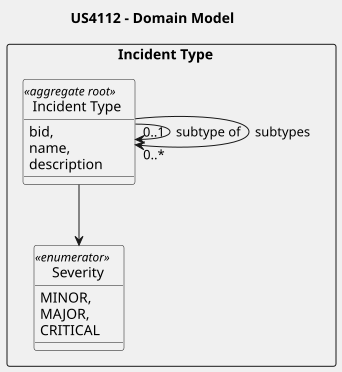

# US4112 - As a Port Authority Officer, I want to manage the catalog of Incident Types so that the classification of operational disruptions remains standardized, hierarchical, and clearly distinct from complementary tasks

### Relevant Domain Model Excerpt:

